# 🛡️ Minor Project Report: Network Traffic Analysis

<p align="center">
  
  
  
  
  
</p>

<p align="center">
  Capturing and analyzing live network traffic to identify suspicious patterns, inspect protocol behavior, and document common attack techniques &mdash; along with the corresponding defenses.
</p>

---

## 📑 Table of Contents

- [Objective](#-objective)
- [Tools Used](#-tools-used)
- [1. Capturing Traffic with Wireshark](#1-capturing-traffic-with-wireshark)
- [2. Protocol Analysis](#2-protocol-analysis)
  - [2.1 HTTP / HTTPS & OCSP](#21-http--https--ocsp)
  - [2.2 DNS](#22-dns-domain-name-system)
  - [2.3 SMTP](#23-smtp-simple-mail-transfer-protocol)
- [3. Common Security Threats & Attack Simulations](#3-common-security-threats--attack-simulations)
  - [3.1 Deauthentication Attack](#31-deauthentication-attack)
  - [3.2 Man-in-the-Middle (MITM) Attack](#32-man-in-the-middle-mitm-attack)
- [4. Recommendations](#4-recommendations)
- [5. Learning Outcomes](#5-learning-outcomes)

---

## 🎯 Objective

Capture and analyze network traffic to identify suspicious patterns and potential security threats, using protocol-level inspection to distinguish normal activity from indicators of compromise.

## 🧰 Tools Used

| Tool | Purpose |
|---|---|
| **Wireshark** | Packet capture and protocol-level traffic analysis |
| **Airodump-ng** | Wireless interface reconnaissance (MAC addresses, BSSID, channel) |
| **Aireplay-ng** | Deauthentication attack simulation |
| **Arpspoof** | ARP cache poisoning for MITM simulation |
| **Bettercap** | Automated MITM / network attack framework |

---

## 1. Capturing Traffic with Wireshark

Wireshark was used to capture traffic on the primary network interface (`eth0`) of a test environment. Selecting an interface — wired or wireless — allows Wireshark to log all packets flowing through it in real time.

Its graphical interface supports filtering by protocol (HTTP, TCP, DNS, etc.) and searching packet contents for specific artifacts such as cookies, `GET`, and `POST` requests.

<p align="center">
  
</p>

**Process followed:**

1. **Airodump-ng** was used to enumerate the MAC addresses of interconnected devices.

   <p align="center">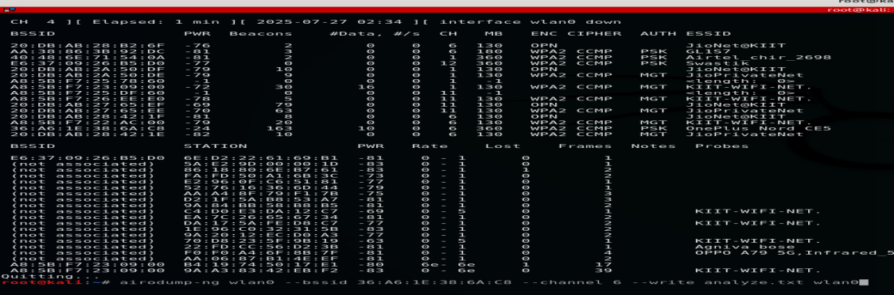</p>

2. The targeted network's **BSSID and channel** were identified for the ISP being hosted.

   <p align="center">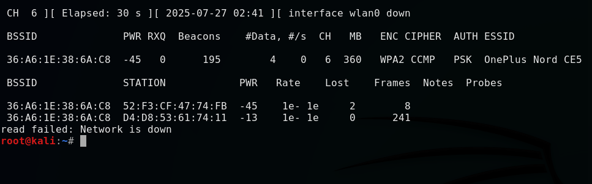</p>

3. The `wireshark` command was run and the saved `analyze.txt` capture from airodump-ng was loaded for analysis.

   <p align="center">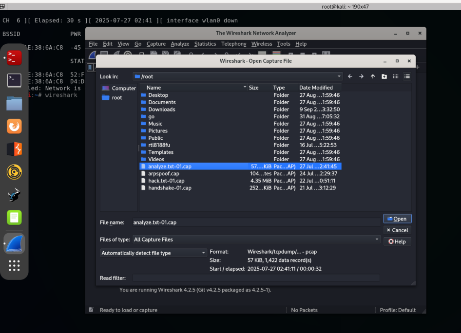</p>

4. All interconnected networks on the host were broadcast and enumerated.

   <p align="center">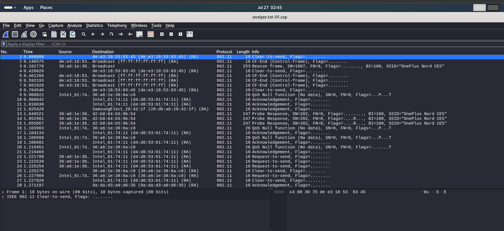</p>

This setup was then used to capture traffic and analyze protocols and anomalies across the network.

---

## 2. Protocol Analysis

Traffic on the NAT adapter `eth0` was captured and broken down by protocol.

<p align="center">
  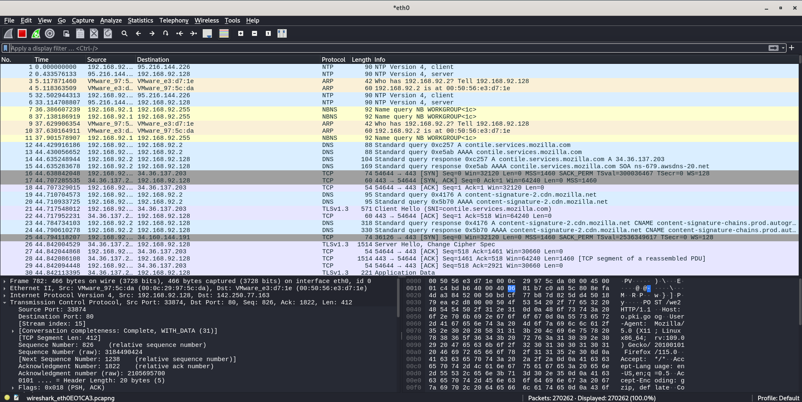
</p>

### 2.1 HTTP / HTTPS & OCSP

*(Hypertext Transfer Protocol Secured / Hypertext Transfer Protocol)*

The capture was filtered on `http` for analysis.

<p align="center">
  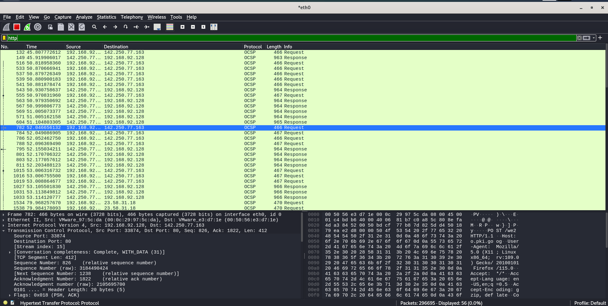
</p>

**Observations:**

- Multiple packets shared a common source and destination within the NAT network. The capture showed repeated **OCSP** (Online Certificate Status Protocol) requests and responses between a local IP (`192.168.77.132`) and various external IPs.

  <p align="center">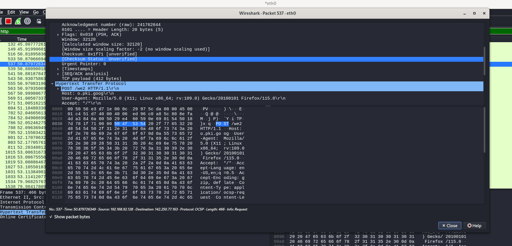</p>

- The **Protocol** column confirmed repeated OCSP use, and the **Info** column distinguished each packet as a request or response.
- No obvious signs of compromise or active exploitation were present. The primary risk here is privacy exposure or, in a more sophisticated attack, manipulation of certificate-revocation checks. OCSP stapling and encrypted validation channels mitigate this.
- No suspicious or unusual port activity was observed.

> **🔒 Prevention tips**
> 1. Prefer OCSP over encrypted (TLS) channels — encryption prevents packet sniffing.
> 2. Traffic spikes on OCSP can indicate failed MITM attempts and are worth monitoring.
> 3. Use WPA2/WPA3 for strong Wi-Fi authentication to harden the network against exploitation.

### 2.2 DNS (Domain Name System)

The capture was filtered on `dns` for analysis.

<p align="center">
  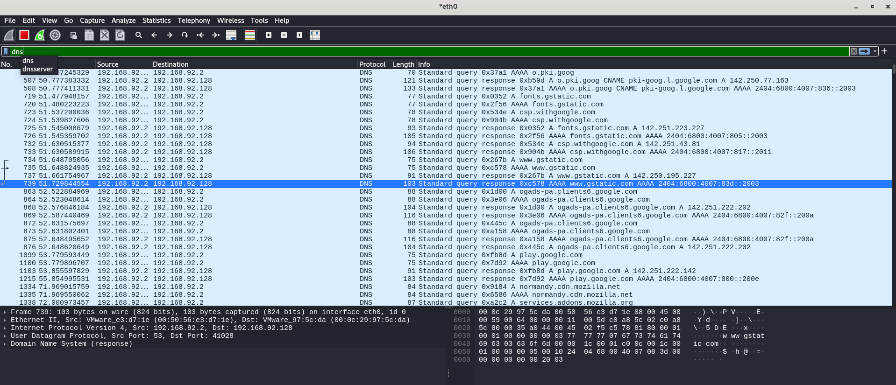
</p>

**Observations:**

- Traffic occurred entirely between local IPs — `192.168.92.2` (likely a DNS server/forwarder) as the **source**, and `192.168.92.128` (the querying client) as the **destination**.
- Queries and responses were standard and legitimate, resolving domains such as `fonts.gstatic.com`, `gstatic.com`, `ogads-pa.clients6.google.com`, `play.google.com`, `normandy.cdn.mozilla.net`, and `mozilla.org`.
- All observed DNS traffic was sent over **UDP/53 in plaintext**.
- Queries and responses appeared routine, resolving to well-known web services with no indication of DNS tunneling, exfiltration, or rare/suspicious domains.

  <p align="center">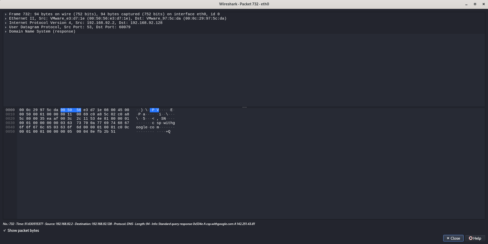</p>

**Associated risks:**

1. **Privacy exposure** — unencrypted DNS lets third parties observe which sites are being visited.
2. **DNS spoofing** — an attacker with local network access can respond to queries faster than the legitimate server, redirecting users to malicious sites (a form of MITM).
3. **Information leakage** — unusual spikes in DNS queries to unsecured (non-HTTPS) domains can signal malicious activity.

> **🔒 Prevention tips**
> - Use **DNS-over-HTTPS (DoH)** or **DNS-over-TLS (DoT)** to prevent passive observation of queries.
> - Restrict unauthorized access to DNS servers.
> - Use threat-intelligence feeds to automatically block requests to high-risk domains.

### 2.3 SMTP (Simple Mail Transfer Protocol)

The capture was filtered on `smtp` for analysis.

<p align="center">
  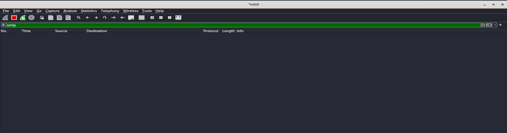
</p>

**Observations:**

- No SMTP servers or related domains were observed in the captured DNS or network traffic.
- This indicates no email-sending activity occurred during the monitoring window.
- The device may not be configured for email, or no email operations took place during capture.

---

## 3. Common Security Threats & Attack Simulations

The following attacks were simulated in a controlled lab environment to understand their mechanics and corresponding defenses.

### 3.1 Deauthentication Attack

**🎯 Aim:** Force-disconnect a target device from a wireless network.

<p align="center">
  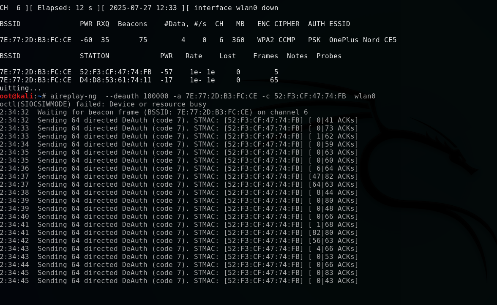
</p>

**Procedure:**

1. A wireless network adapter supporting **monitor mode** and packet injection is required.
2. Enable monitor mode on the `wlan0` interface to capture traffic across the same subnet:

   ```bash
   ifconfig wlan0 down
   iwconfig wlan0 mode monitor
   ifconfig wlan0 up   # captures all packets on the same subnet
   ```

   <p align="center">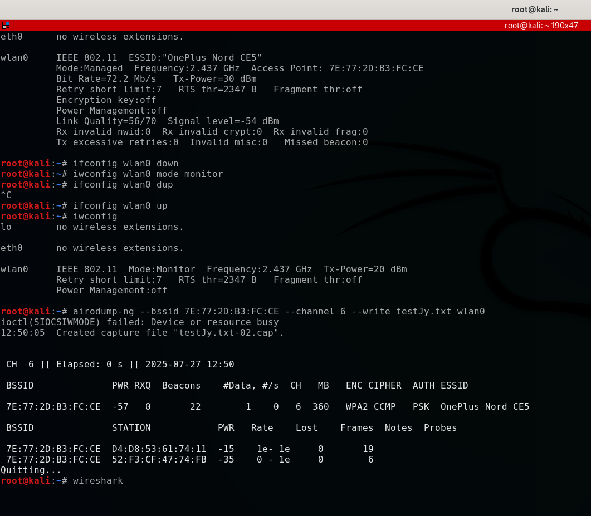</p>

3. Use Wireshark to identify the target device and confirm all networks connected to the host.

   <p align="center">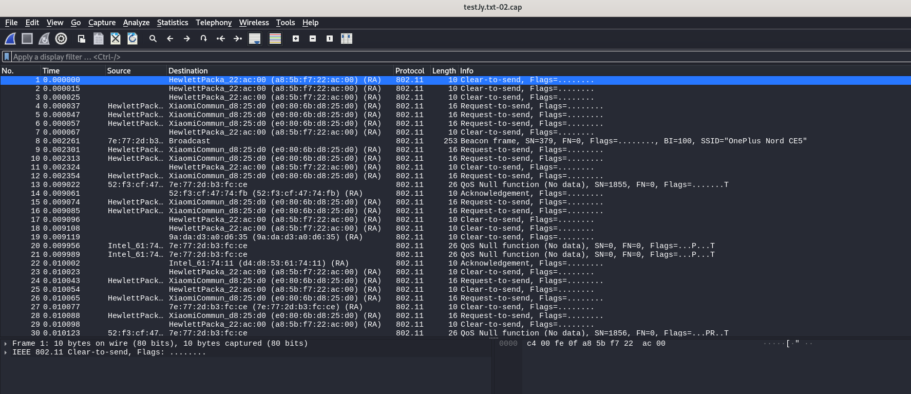</p>

4. Launch the deauthentication attack:

   ```bash
   aireplay-ng --deauth <number_of_packets> --a <source_IP/ISP> -c <target_IP> <interface_name>
   ```

5. The target device remains disconnected from the host until the attack is stopped or the packet count is exhausted.

### 3.2 Man-in-the-Middle (MITM) Attack

#### A. ARP Spoofing *(Address Resolution Protocol)*

In this attack, the attacker intercepts communication between two devices (client and server). ARP links IP addresses to MAC addresses; by poisoning the ARP cache, the attacker's machine masquerades as the server to the client and as the client to the server — becoming the invisible middleman for all traffic.

**Tools used:** Wireshark (analysis), `arpspoof`

**Procedure:**

1. Identify the IP addresses of both the client and server.
2. Identify the gateway for both. (Example setup: attacker on **Kali Linux**, target on **Windows 10**.)
3. Retrieve each machine's gateway:

   ```bash
   arp -a   # run on both Kali Linux and Windows 10
   ```

4. Use Wireshark to confirm the networks connected to the host IP.

   <p align="center"></p>

5. Run ARP spoofing in two split terminals simultaneously:

   ```bash
   arpspoof -i <interface> -t <client_IP> <gateway_IP>
   arpspoof -i <interface> -t <gateway_IP> <client_IP>
   ```

   <p align="center">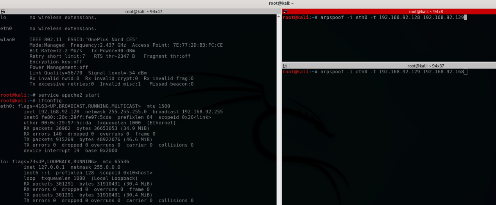</p>

   With both directions active, packets exchanged between client and server flow through the attacker's channel.

#### B. Using Bettercap

Bettercap is a framework for running and redirecting network attacks with minimal setup.

**Procedure:**

```bash
# 1. Open the Bettercap interface
bettercap -iface <interface>

# 2. Enable network probing
net.probe on

# 3. Enable full-duplex ARP spoofing (targets both gateway and victim)
set arp.spoof.fullduplex true

# 4. Set the target IPv4 address
#    (on the target machine, confirm with: arp -a)

# 5. Start ARP spoofing
arp.spoof on
```

<p align="center">
  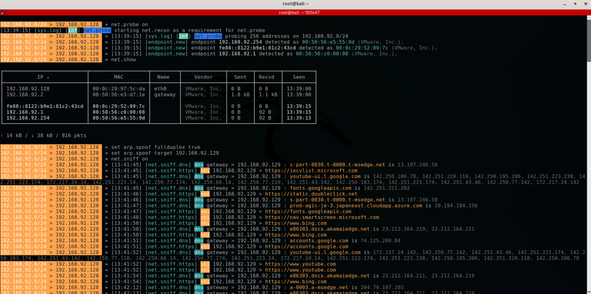
  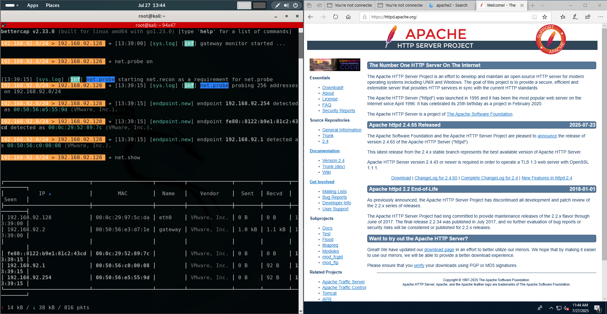
</p>
<p align="center">
  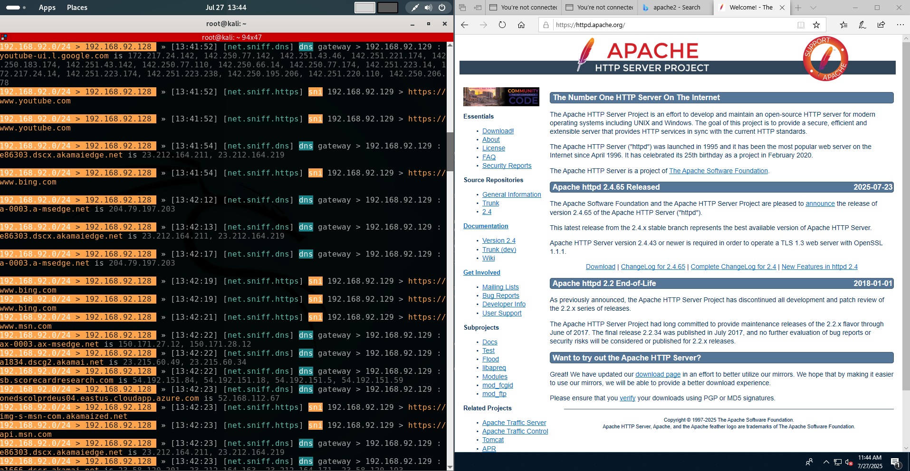
  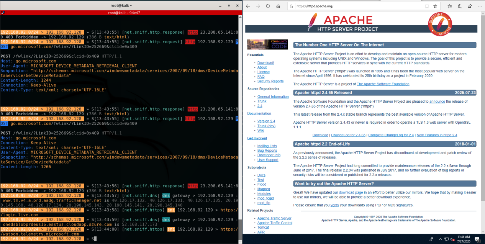
</p>

With the attack active, traffic originating from the target (Windows) machine was successfully captured by the attacking machine (Kali Linux) — including, potentially, sensitive data such as usernames and passwords submitted over unencrypted channels.

> **🔒 Prevention strategy**
> 1. Enable **WPA/WPA2** encryption on the wireless network.
> 2. Clients should never accept unsolicited/shared responses from a server without verification.
> 3. Clients should never trust a network resource before verifying its authenticity.
> 4. Prefer **HTTPS** sites — even if packets are sniffed, encrypted (ciphertext) payloads remain unreadable to the attacker.

---

## 4. Recommendations

- 🔁 Maintain **routine network traffic monitoring** as a standard practice, especially after infrastructure changes or updates.
- 🚨 Consider deploying a **network intrusion detection system (NIDS)** for deeper, automated threat alerting.
- 📧 Educate users on the risks of opening **unsolicited email attachments** and visiting **unidentified websites** — still among the most common attack vectors.
- 🔍 Periodically **review DNS logs** for anomalous queries, which can surface emerging threats before a full attack takes place.

---

## 5. Learning Outcomes

**Core outcomes**

- ✅ Understanding of network protocols and traffic patterns
- ✅ Ability to use Wireshark to capture and analyze network traffic
- ✅ Knowledge of common network security threats
- ✅ Ability to identify suspicious network activity

**Bonus outcomes**

- ✅ Explored tools used to attack common network loopholes
- ✅ Learned mitigation strategies to prevent identified attack vectors

---

<p align="center">
  <sub>⚠️ All attacks in this report were performed in an isolated, controlled lab environment for educational purposes only.</sub>
</p>
